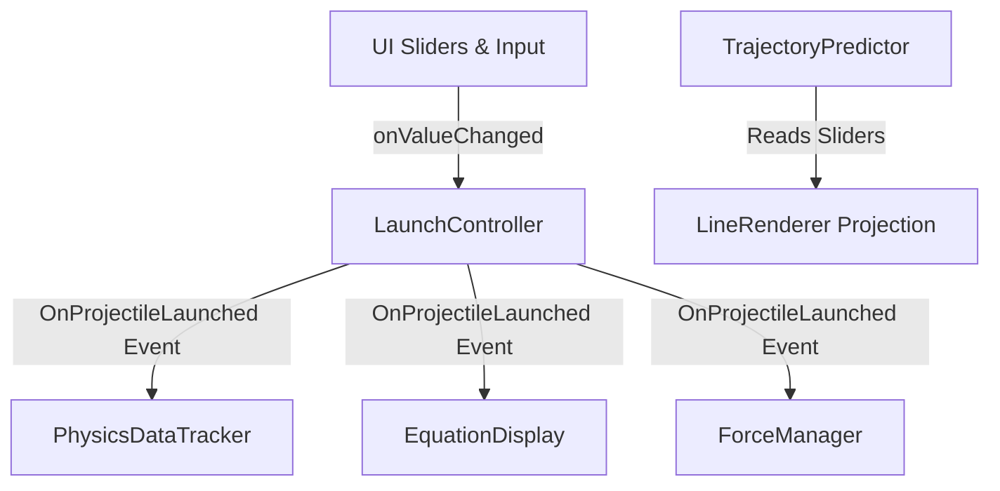

# 🧪 Newton's Lab — 3D Gamified Physics Laboratory


> **Newton's Lab** es un laboratorio interactivo y simulador educativo en 3D desarrollado en Unity. Permite a los estudiantes y entusiastas experimentar con cinemática 3D, las leyes de Newton y fuerzas ambientales en tiempo real, conectando conceptos matemáticos abstractos con comportamientos físicos visuales.

---

## 🌟 Key Features & Technical Highlights

### 🎯 1. Real-Time Kinematic Trajectory Prediction ("Wow" Feature)
* **Algoritmo Cinemático Proyectivo:** Calcula y dibuja la parábola esperada del proyectil ($\vec{r}(t) = \vec{r}_0 + \vec{v}_0 t + \frac{1}{2}\vec{a}t^2$) en tiempo real antes de efectuar el disparo.
* **Respuesta Dinámica:** La trayectoria predictiva se ajusta instantáneamente mientras el usuario arrastra los controles de ángulo, velocidad o viento.

### 🏗️ 2. Event-Driven Architecture (Clean Code & SOLID)
* **Patrón Observer (`System.Action`):** Total desacoplamiento entre el controlador de disparos (`LaunchController`) y los sistemas de análisis.
* **Optimización de CPU:** Se eliminó el *polling* innecesario en `Update()`, migrando la UI a un modelo de suscripción reactiva a eventos (`onValueChanged`).

### 📊 3. HUD Científico y Ecuaciones en Tiempo Real
* **Live Equations:** Renderizado dinámico de las ecuaciones por componentes ($x(t)$, $y(t)$, $z(t)$) con valores numéricos reales durante el vuelo.
* **Métricas de Rendimiento:** Seguimiento de Apogeo (Altura Máxima $Y_{max}$) y Alcance ($X_{max}$).
* **Formato Rich Text:** Colores adaptados a estándar de interfaz académica para alta legibilidad.

### 🎨 4. Game Feel, Visual Feedback & 3D Vectors
* **Visualizador de Vector de Velocidad ($\vec{V}_0$):** Flecha 3D dinámica en el origen que escala con la magnitud de la velocidad e indica la dirección exacta del vector inicial.
* **Juice Físico:** Partículas de impacto en suelo, rastro con `TrailRenderer` y paneles con estética *Slate Dark Glassmorphism*.

---

## 🏛️ System Architecture



---

## 💻 Code Showcase

### 1. Desacoplamiento mediante Eventos (`LaunchController.cs`)
```csharp
public class LaunchController : MonoBehaviour
{
    // Eventos estáticos para el patrón Observer
    public static event Action<GameObject, Vector3, float> OnProjectileLaunched;
    public static event Action OnSceneReset;

    public void Launch()
    {
        // Instanciación y aplicación de velocidad inicial
        GameObject projectile = Instantiate(projectilePrefab, transform.position, Quaternion.identity);
        Rigidbody rb = projectile.GetComponent<Rigidbody>();
        rb.linearVelocity = velocity;

        // Notificación desacoplada a todos los sistemas suscritos
        OnProjectileLaunched?.Invoke(projectile, velocity, mass);
    }
}
```

### 2. Algoritmo de Predicción Cinemática (`TrajectoryPredictor.cs`)
```csharp
void DrawPrediction()
{
    Vector3 vel = new Vector3(Mathf.Cos(angleRad) * speed, Mathf.Sin(angleRad) * speed, 0);
    Vector3 grav = Physics.gravity + new Vector3(windAcc, 0, 0);

    for (int i = 0; i < resolution; i++)
    {
        float t = i * timeStep;
        Vector3 point = startPos + vel * t + 0.5f * grav * t * t;
        lr.SetPosition(i, point);
        if (i > 0 && point.y < 0) break; // Detección de suelo
    }
}
```

---

## 📁 Project Structure

```text
Assets/
 ├── Materiales/            # Materiales de escena y shaders
 ├── Prefab/                # Prefabs (Proyectil, Partículas de Impacto)
 ├── Scenes/                # Escenas del laboratorio
 └── Scripts/               # Código Fuente C#
      ├── LaunchController.cs           # Control central y emisores de eventos
      ├── PhysicsDataTracker.cs         # Muestreo de datos físicos en vivo
      ├── EquationDisplay.cs            # Formateador dinámico de ecuaciones
      ├── ForceManager.cs               # Simulación de viento y resistencia
      ├── TrajectoryPredictor.cs        # Predicción cinemática previa al tiro
      ├── TrajectoryRecorder.cs         # Trazo de la trayectoria real
      ├── VelocityVectorVisualizer.cs   # Flecha 3D de vector inicial
      ├── TimeController.cs             # Pausa y Slow-Motion (Time.timeScale)
      └── UIPanelPolisher.cs            # Estilizado visual de paneles UI
```

---

## 🎮 Controles de la Simulación

| Control | Acción |
| :--- | :--- |
| **Sliders UI** | Configura Velocidad ($m/s$), Ángulo ($°$), Masa ($kg$) y Viento |
| **Espacio / Botón** | Ejecuta el Lanzamiento del proyectil |
| **Botón Reiniciar** | Limpia la escena y restablece variables |
| **Controles de Tiempo** | Pausa la simulación o activa Slow-Motion ($0.2x$) |

---

## 🎓 Conceptos Físicos Demostrados
1. **Primera Ley de Newton (Inercia):** Observación del movimiento sin fuerzas externas activas.
2. **Segunda Ley de Newton ($F = m \cdot a$):** Variación de la masa y observación del cambio en aceleración.
3. **Cinemática Parabólica 3D:** Descomposición de vectores $v_x, v_y, v_z$ e integración del movimiento rectilíneo y acelerado.

---

## 📄 License
Este proyecto está bajo la Licencia MIT.
